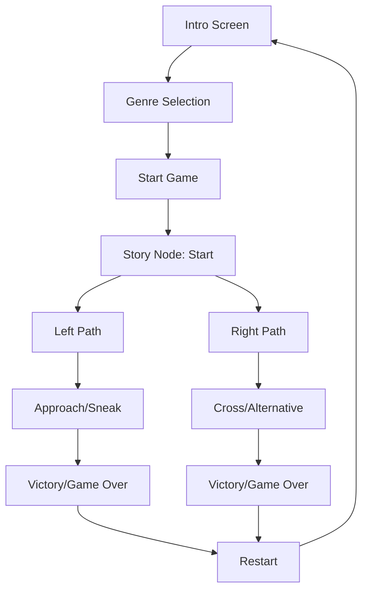

# 🎮 Mythoria - Interactive Story Game

[](https://sekhmdrakibulhossen.github.io/mythoria-game)
[]()
[]()

> **A choice-based interactive story game with multiple genres and branching narratives**

Created by **SEKH MD RAKIBUL HOSSEN**

## 🌟 Features

### 🎭 Multiple Genres
- **Adventure**: Epic quests, magical artifacts, and heroic journeys
- **Horror**: Supernatural encounters, haunted locations, and spine-chilling mysteries  
- **Sci-Fi**: Alien worlds, advanced technology, and galactic adventures

### 🎮 Interactive Gameplay
- **Choice-driven narrative** with meaningful decisions
- **Dynamic story paths** that change based on your choices
- **Immersive visuals** with genre-appropriate imagery
- **Responsive design** that works on all devices

### 🎨 User Experience
- Beautiful intro screen with genre selection
- Visual story scenes with atmospheric images
- Interactive choice buttons for easy navigation
- Restart functionality to try different paths
- Genre indicator to track your current adventure

## 🚀 How to Play

1. **Choose Your Genre**: Select Adventure, Horror, or Sci-Fi
2. **Start Your Journey**: Click "Start Your Adventure"
3. **Make Choices**: Read the story and click your preferred choice
4. **Explore Paths**: Each choice leads to different outcomes
5. **Restart Anytime**: Use the restart button to try new adventures

## 🛠️ Technical Implementation

### Technologies Used
- **HTML5**: Semantic structure and accessibility
- **CSS3**: Modern styling with flexbox/grid and animations
- **Vanilla JavaScript**: Dynamic story loading and interaction handling
- **Responsive Design**: Mobile-first approach with media queries

### Key Features
```javascript
// Dynamic story system
const gameData = {
    currentGenre: '',
    storyNodes: {
        // Genre-specific content for each story node
    }
};
```

### File Structure
```
mythoria-game/
├── index.html          # Main HTML structure
├── styles.css          # Complete styling and animations
├── script.js           # Game logic and interactivity
└── README.md          # Documentation (this file)
```

## 🎯 Game Flow



## 🎨 Story Branches

### Starting Point
All genres begin with the player awakening in a mysterious location with two path choices.

### Adventure Path
- **Castle Route**: Meet kings, accept quests, become a legendary hero
- **River Route**: Cross bridges, find treasures, discover ancient magic

### Horror Path  
- **Mansion Route**: Face supernatural entities, moving portraits, ghostly encounters
- **River Route**: Navigate blood-red waters, encounter spirits, find salvation

### Sci-Fi Path
- **Space Station Route**: Meet AI holograms, save the galaxy, advanced technology
- **Control Room Route**: Bypass energy barriers, alien defenses, cosmic missions

## 🔧 Customization

### Adding New Story Nodes
```javascript
// Add to gameData.storyNodes
newNode: {
    text: {
        Adventure: "Your adventure text...",
        Horror: "Your horror text...",
        'Sci-Fi': "Your sci-fi text..."
    },
    image: {
        Adventure: "image-url-adventure",
        Horror: "image-url-horror", 
        'Sci-Fi': "image-url-scifi"
    },
    choices: [
        { label: "Choice 1", next: "nodeId1" },
        { label: "Choice 2", next: "nodeId2" }
    ]
}
```

### Styling Customization
The CSS uses CSS custom properties for easy theme customization:
```css
:root {
    --primary-gold: #d4af37;
    --background-dark: #2c1810;
    --text-light: #f4f1e8;
}
```

## 📱 Responsive Design

- **Desktop**: Side-by-side layout with image and story content
- **Tablet**: Optimized grid layout with touch-friendly buttons  
- **Mobile**: Single-column layout with stacked elements

## 🌐 Deployment

### GitHub Pages (Recommended)
1. Enable GitHub Pages in repository settings
2. Select source: Deploy from a branch (main)
3. Your game will be available at: `https://username.github.io/mythoria-game`

### Local Development
```bash
# Clone the repository
git clone https://github.com/SEKHMDRAKIBULHOSSEN/mythoria-game.git

# Navigate to directory
cd mythoria-game

# Open in browser
open index.html
```

## 🎮 Live Demo

🔗 **Play Now**: [Mythoria Game](https://sekhmdrakibulhossen.github.io/mythoria-game)

## 📈 Future Enhancements

- [ ] **Save System**: Remember progress across sessions
- [ ] **Sound Effects**: Audio for different genres and actions
- [ ] **Achievement System**: Unlock badges for different story paths
- [ ] **More Genres**: Fantasy, Mystery, Romance options
- [ ] **Expanded Stories**: Longer narratives with more branches
- [ ] **Character Stats**: RPG elements with health/magic/tech points
- [ ] **Multiplayer Mode**: Collaborative storytelling features

## 🤝 Contributing

1. Fork the repository
2. Create a feature branch (`git checkout -b feature/amazing-feature`)
3. Commit your changes (`git commit -m 'Add amazing feature'`)
4. Push to the branch (`git push origin feature/amazing-feature`)
5. Open a Pull Request

## 📄 License

This project is licensed under the MIT License - see the [LICENSE](LICENSE) file for details.

## 👨‍💻 Author

**SEKH MD RAKIBUL HOSSEN**
- GitHub: [@SEKHMDRAKIBULHOSSEN](https://github.com/SEKHMDRAKIBULHOSSEN)
- Created: September 2, 2025

## 🙏 Acknowledgments

- Images sourced from [Unsplash](https://unsplash.com) for atmospheric visuals
- Inspiration from classic interactive fiction games
- Modern web technologies for seamless user experience

---

*Experience the magic of interactive storytelling with Mythoria! 🌟*
